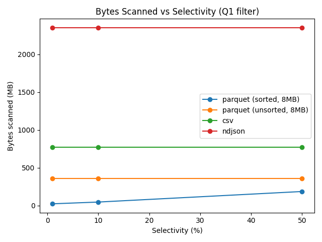
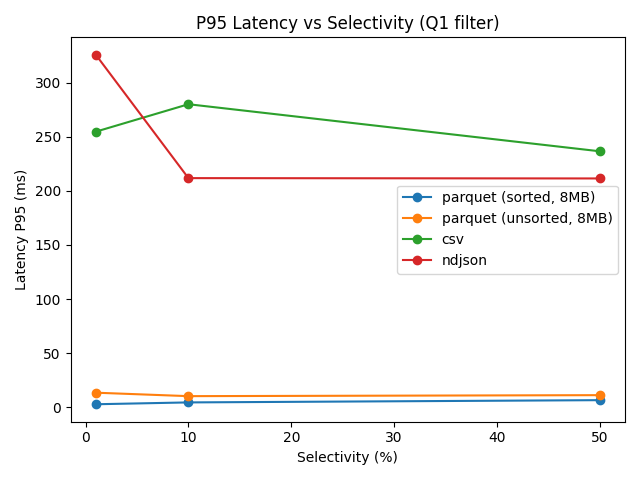
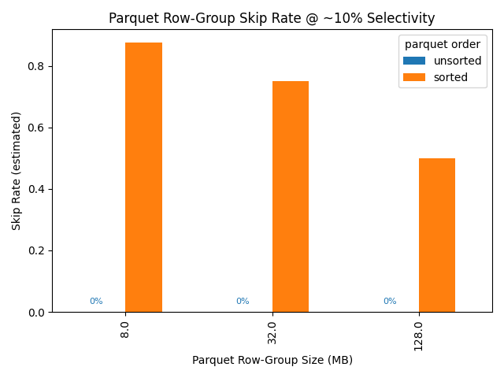

# FormatBench (Format Effects Methodology)

Reproducible format-effects benchmark on DuckDB (Parquet vs CSV/NDJSON): varies selectivity, Parquet row-group size/compression, sorted/unsorted layouts; measures P50/P95, bytes scanned, and skip rate with scripts, metrics, plots, and provenance for one-command reruns.

**Goal.** Isolate *format-level* effects on scan efficiency and tail latency using one engine (DuckDB): Parquet vs CSV vs NDJSON.  
**What it measures.** P50/P95 latency, bytes scanned (approx), and Parquet row-group skip rate across a *small factor matrix*: selectivity, Parquet row-group size, and Parquet compression.

## Quickstart
Prereqs: Python 3.9+ and `python3` on PATH (tested with DuckDB ≥1.0).
```bash
python3 -m venv .venv && source .venv/bin/activate
pip install -r requirements.txt
python3 scripts/prepare_data.py           # generates TPC-H data + format variants
python3 scripts/run_matrix.py             # runs the factor matrix, saves metrics & profiles
python3 scripts/plot_results.py           # renders figures from metrics.csv
```

- Current config: Parquet row-groups 8/32/128 MB, compression NONE/ZSTD, sorted and unsorted variants, selectivities 1/10/50%, 15 repetitions per point (`runs_per_case` in `config.yaml`; lower for speed).
- Parquet bytes scanned and skip rate are derived from row-group metadata (not runtime counters); enough for relative comparisons across formats/layouts.

## Plots
- Generated PNGs land in `plots/` (e.g., `fig_bytes_vs_selectivity.png`, `fig_p95_vs_selectivity.png`, `fig_skiprate_vs_rowgroup.png`).
- Inputs: `results/metrics.csv` (produced by `scripts/run_matrix.py`). Recreate plots with `python3 scripts/plot_results.py`.
- The plotting script pins `MPLCONFIGDIR` to `.mplconfig/` so font caches stay local to the repo and out of git.
- Snapshot below was generated with the current `config.yaml`:







Runtime note: with `runs_per_case` set to 15 (as in the current `config.yaml`), a full matrix including CSV/NDJSON can take ~40–50 minutes on a laptop. Lower `runs_per_case` or disable heavy cases (e.g., NDJSON or Q2/Q3) for quicker runs.
